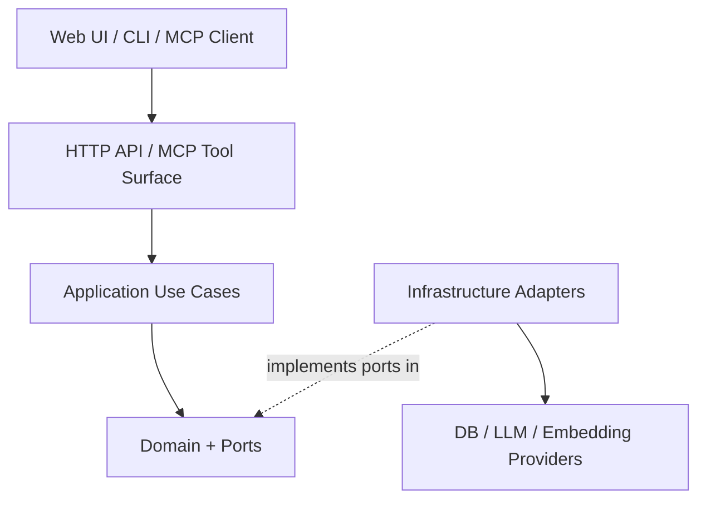
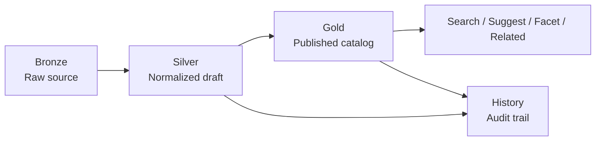
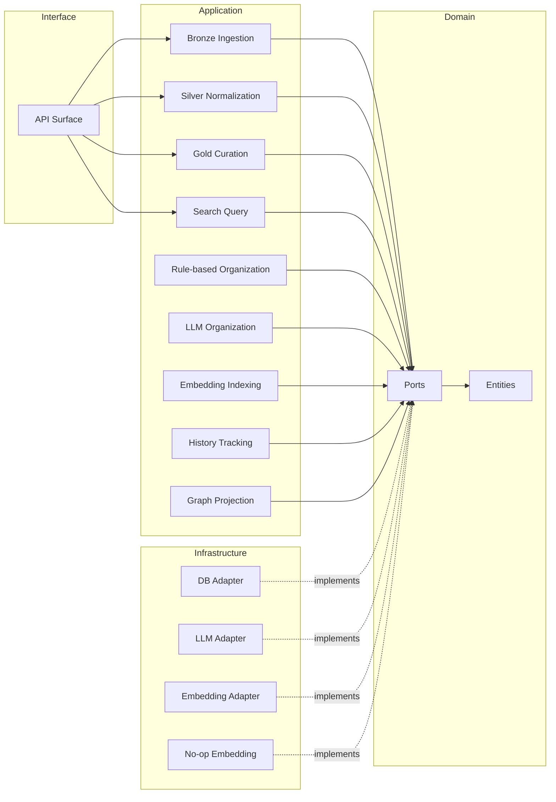

# アーキテクチャ概要

## 目的
本システムは、MCP サーバーのナレッジを収集、正規化、公開、検索するための API 中心アプリケーションである。
アーキテクチャの目的は次の 4 点である。

1. Bronze / Silver / Gold の責務分離を明確にする
2. DB、Embedding、LLM を差し替え可能にする
3. 検索、整理、履歴を疎結合なユースケースとして保つ
4. GitHub 公開しやすいシンプルな構成を維持する

## 採用アーキテクチャ
Medallion 構造をデータライフサイクルの軸に置き、その上に Ports and Adapters を重ねる。

- Medallion: データ品質と責務を Bronze / Silver / Gold に分ける
- Ports and Adapters: 外部依存を Port 契約越しに扱い、DB / LLM / Embedding を差し替える
- API-first: 機能の正面入口は HTTP API とし、同じユースケースを MCP ツールにも対応させる

## レイヤ構成

## データライフサイクル

## 差し替え可能なコンポーネント
### DB
- Port: `IKnowledgeRepository`, `IHistoryRepository`, `IUnitOfWork`
- 既定実装: EF Core + SQLite
- 差し替え候補: EF Core + PostgreSQL, EF Core + SQL Server

### LLM
- Port: `IOrganizationAgent`
- 既定実装: Microsoft Agent Framework + Foundry Adapter
- 差し替え候補: Azure OpenAI Adapter, OpenAI 互換 Adapter, Mock Adapter

### Embedding
- Port: `IEmbeddingGenerator`, `ISemanticIndexer`
- 既定実装: No-op または disabled
- 差し替え候補: `text-embedding-3-small`, `text-embedding-3-large`, OSS Embedding

## モジュール関係図

## 設計原則
- ドメインルールは SDK 固有型を露出しない
- 外部サービスは Application から直接呼ばず Adapter を介す
- Embedding と LLM は feature flag または設定で有効化する
- 検索の主系統は構造化検索とし、Embedding 検索は補助機能として追加する
- 関連エントリ算出は GraphProjection に閉じ込め、API 契約を単純に保つ

## 実装ガイド
- Bronze / Silver / Gold の更新は単一ユースケースに閉じ込める
- LLM の出力は必ず構造化し、業務ルールで再検証する
- Embedding が無効でも検索と閲覧の主機能が落ちないようにする
- DB 切り替え時も API 契約とドメインモデルは維持する