# モジュール設計

## モジュール一覧
| モジュール名 | 責務 | 依存してよいモジュール |
|:--|:--|:--|
| Api | HTTP エンドポイント、入力検証、DTO 変換 | Application, Query |
| BronzeIngestion | 生データの取り込み、重複判定、Bronze 永続化 | Persistence, HistoryTracking |
| SilverNormalization | Bronze から正規化済み下書きを生成 | Persistence, HistoryTracking |
| GoldCuration | Silver から公開カタログを生成、更新する | Persistence, TagManagement, HistoryTracking |
| AgentOrganization | LLM を使った自動整理を行う | SilverNormalization, GoldCuration, HistoryTracking |
| RuleBasedOrganization | LLM 無効時の規則ベース整理を行う | SilverNormalization, GoldCuration, HistoryTracking |
| SearchQuery | Gold カタログの検索、詳細取得を行う | Persistence |
| TagManagement | タグの制約検証、全置換更新を行う | Persistence, HistoryTracking |
| HistoryTracking | 更新履歴を追記、取得する | Persistence |
| GraphProjection | Gold / Silver データから関係グラフを組み立てる | Persistence |
| Persistence | EF Core DbContext、Repository、Provider 切り替え | なし |

## 依存関係の方針
- Api は DB や Agent Framework を直接参照せず、Application 層経由で操作する
- Bronze / Silver / Gold は層をまたいで直接更新しない
  - BronzeIngestion は Bronze のみ作成する
  - SilverNormalization は Bronze を読み、Silver を作る
  - GoldCuration は Silver を読み、Gold を作る
- AgentOrganization は直接 DB を好き勝手に更新せず、SilverNormalization と GoldCuration の業務ルールを経由する
- RuleBasedOrganization と AgentOrganization は同じ入出力契約を持ち、設定で差し替え可能にする
- HistoryTracking は Gold 更新系処理の横断関心として扱う
- GraphProjection は検索や推薦の補助情報を作るが、MVP の正規データソースにはしない

## 主な責務境界
### BronzeIngestion
- 生入力の受け取り
- 入力ソース種別の記録
- 元テキストの完全保持
- 重複検知用のハッシュ計算

### SilverNormalization
- 名前、概要、認証方式、ツール一覧、リンクの抽出
- ツール単位の下書き生成
- 不完全データの `unknown` 補完

### GoldCuration
- 公開用表示モデルの作成
- タグ制約の検証
- 検索しやすい構造への整形
- 変更時の履歴記録

### AgentOrganization
- LLM が有効な場合のみ起動する
- 構造化出力でタグ提案、要約、関係抽出を返す
- 生成結果は即時反映ではなく、既存の業務ルールで再検証する

### SearchQuery
- キーワード検索を実行する
- 詳細検索用の複合条件を解釈する
- 検索候補サジェストを生成する
- ファセット集計を返す
- 関連エントリを返す

## クラス図

```mermaid
classDiagram
    class BronzeSource {
        +Guid Id
        +string SourceType
        +string RawContent
        +string SourceUri
        +string Status
        +DateTime ImportedAtUtc
    }

    class SilverServerDraft {
        +Guid Id
        +Guid BronzeSourceId
        +string Name
        +string Summary
        +string AuthenticationType
        +DateTime NormalizedAtUtc
    }

    class SilverToolDraft {
        +Guid Id
        +Guid ServerDraftId
        +string Name
        +string Description
    }

    class GoldCatalogEntry {
        +Guid Id
        +Guid SilverServerDraftId
        +string DisplayName
        +string Overview
        +string SetupGuide
        +DateTime PublishedAtUtc
    }

    class EntryTag {
        +Guid EntryId
        +string Value
    }

    class EntryHistory {
        +Guid Id
        +Guid EntryId
        +string Action
        +string ChangedBy
        +DateTime ChangedAtUtc
        +string Summary
        +bool UsedLlm
    }

    class BronzeIngestionService {
        +ImportAsync(request) BronzeSource
    }

    class SilverNormalizationService {
        +NormalizeAsync(bronzeId) SilverServerDraft
    }

    class GoldCurationService {
        +PublishAsync(silverId) GoldCatalogEntry
        +UpdateAsync(entryId, request) GoldCatalogEntry
    }

    class IOrganizationAgent {
        +OrganizeAsync(request) OrganizationResult
    }

    class RuleBasedOrganizationAgent {
        +OrganizeAsync(request) OrganizationResult
    }

    class MafFoundryOrganizationAgent {
        +OrganizeAsync(request) OrganizationResult
    }

    class SearchService {
        +SearchAsync(query) CatalogSearchResult
        +AdvancedSearchAsync(query) CatalogSearchResult
        +SuggestAsync(query, scope, limit) SearchSuggestionResult
        +GetFacetsAsync(query) SearchFacetResult
        +GetRelatedAsync(entryId, strategy, limit) RelatedCatalogEntry[]
        +GetDetailAsync(entryId) GoldCatalogEntry
    }

    class TagService {
        +ReplaceTagsAsync(entryId, tags) TagUpdateResult
    }

    class HistoryService {
        +AppendAsync(entryId, action) void
        +ListAsync(entryId, page, pageSize) EntryHistory[]
    }

    class GraphProjectionService {
        +BuildAsync(entryId) EntryGraph
    }

    class McpKnowledgeDbContext {
        +DbSet~BronzeSource~ BronzeSources
        +DbSet~SilverServerDraft~ SilverServerDrafts
        +DbSet~SilverToolDraft~ SilverToolDrafts
        +DbSet~GoldCatalogEntry~ GoldCatalogEntries
        +DbSet~EntryTag~ EntryTags
        +DbSet~EntryHistory~ EntryHistories
    }

    BronzeSource --> SilverServerDraft
    SilverServerDraft --> SilverToolDraft
    SilverServerDraft --> GoldCatalogEntry
    GoldCatalogEntry --> EntryTag
    GoldCatalogEntry --> EntryHistory
    BronzeIngestionService --> McpKnowledgeDbContext
    SilverNormalizationService --> McpKnowledgeDbContext
    GoldCurationService --> McpKnowledgeDbContext
    RuleBasedOrganizationAgent ..|> IOrganizationAgent
    MafFoundryOrganizationAgent ..|> IOrganizationAgent
    GoldCurationService --> TagService
    GoldCurationService --> HistoryService
    SearchService --> McpKnowledgeDbContext
    GraphProjectionService --> McpKnowledgeDbContext
```

