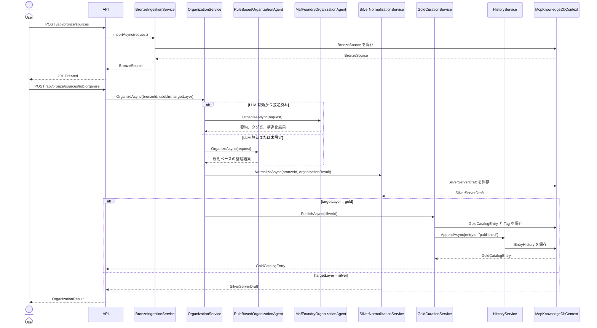

# シーケンス図

## Bronze 取り込みから Gold 公開まで

```mermaid
sequenceDiagram
    actor User
    participant API
    participant BronzeService as BronzeIngestionService
    participant Organizer as OrganizationService
    participant RuleAgent as RuleBasedOrganizationAgent
    participant LlmAgent as MafFoundryOrganizationAgent
    participant SilverService as SilverNormalizationService
    participant GoldService as GoldCurationService
    participant HistoryService
    participant DB as McpKnowledgeDbContext

    User->>API: POST /api/bronze/sources
    API->>BronzeService: ImportAsync(request)
    BronzeService->>DB: BronzeSource を保存
    DB-->>BronzeService: BronzeSource
    BronzeService-->>API: BronzeSource
    API-->>User: 201 Created

    User->>API: POST /api/bronze/sources/{id}:organize
    API->>Organizer: OrganizeAsync(bronzeId, useLlm, targetLayer)

    alt LLM 有効かつ設定済み
        Organizer->>LlmAgent: OrganizeAsync(request)
        LlmAgent-->>Organizer: 要約、タグ案、構造化結果
    else LLM 無効または未設定
        Organizer->>RuleAgent: OrganizeAsync(request)
        RuleAgent-->>Organizer: 規則ベースの整理結果
    end

    Organizer->>SilverService: NormalizeAsync(bronzeId, organizationResult)
    SilverService->>DB: SilverServerDraft を保存
    DB-->>SilverService: SilverServerDraft

    alt targetLayer = gold
        Organizer->>GoldService: PublishAsync(silverId)
        GoldService->>DB: GoldCatalogEntry と Tag を保存
        GoldService->>HistoryService: AppendAsync(entryId, "published")
        HistoryService->>DB: EntryHistory を保存
        DB-->>GoldService: GoldCatalogEntry
        GoldService-->>API: GoldCatalogEntry
    else targetLayer = silver
        SilverService-->>API: SilverServerDraft
    end

    API-->>User: OrganizationResult
```

## 公開カタログの検索と履歴参照

```mermaid
sequenceDiagram
    actor User
    participant API
    participant SearchService
    participant TagService
    participant HistoryService
    participant DB as McpKnowledgeDbContext

    User->>API: GET /api/search?q=registry&tags=github
    API->>SearchService: SearchAsync(query)
    SearchService->>DB: GoldCatalogEntry を検索
    DB-->>SearchService: 検索結果
    SearchService-->>API: CatalogSearchResult
    API-->>User: 200 OK

    User->>API: PUT /api/gold/catalog/{id}/tags
    API->>TagService: ReplaceTagsAsync(entryId, tags)
    TagService->>DB: Tag を全置換
    TagService->>HistoryService: AppendAsync(entryId, "tags-replaced")
    HistoryService->>DB: EntryHistory を保存
    API-->>User: 200 OK

    User->>API: GET /api/gold/catalog/{id}/history
    API->>HistoryService: ListAsync(entryId, page, pageSize)
    HistoryService->>DB: 履歴を取得
    DB-->>HistoryService: EntryHistory[]
    HistoryService-->>API: EntryHistory[]
    API-->>User: 200 OK
```
