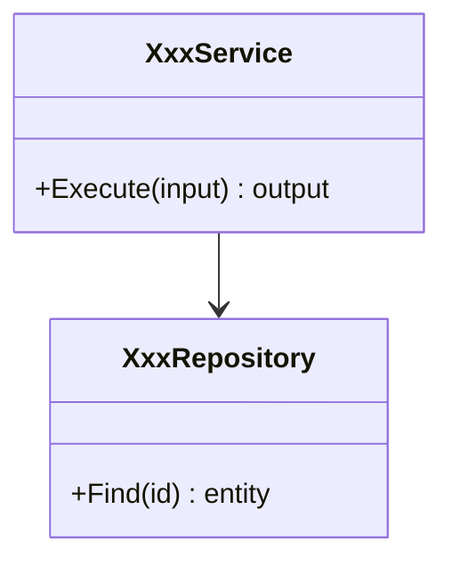

# モジュール設計

## モジュール一覧
| モジュール名 | 責務 | 依存してよいモジュール |
|:--|:--|:--|
| | | |

## 依存関係の方針

## クラス図

```mermaid
classDiagram
    class XxxService {
        +Execute(input) output
    }
    class XxxRepository {
        +Find(id) entity
    }
    XxxService --> XxxRepository
```
