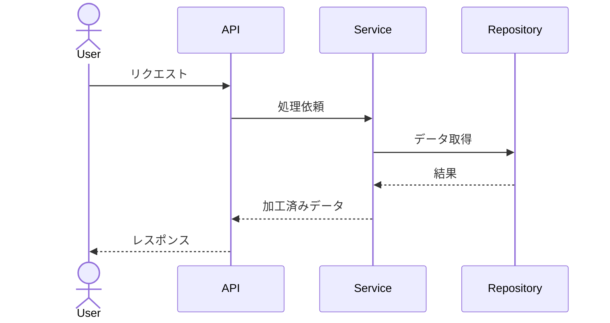

# シーケンス図

## ユースケース名

```mermaid
sequenceDiagram
    actor User
    participant API
    participant Service
    participant Repository
    User->>API: リクエスト
    API->>Service: 処理依頼
    Service->>Repository: データ取得
    Repository-->>Service: 結果
    Service-->>API: 加工済みデータ
    API-->>User: レスポンス
```
