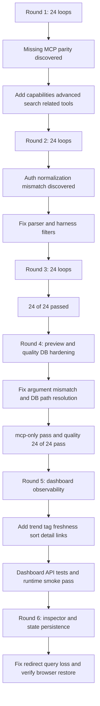

# 2026-05-19 MCP 品質改善レポート

## 概要
2026-05-19 時点の QuartzKnowledge MCP server に対し、MCP 経由の実運用に近い検査と修正を反復した。
今回の改善では、MCP tool parity を拡張し、MCP 専用の大容量データ投入と 24 回反復の品質 harness を追加した。
加えて、人間が knowledge server の状態を直接確認できる dashboard を追加し、検索・鮮度・タグ・推移を一画面で観測できるようにした。

## 実施方針
- MCP 経由で大きめのデータを投入する
- 20 回以上の反復検査を回す
- 失敗を観測したら server または harness を修正する
- 同じ検査を再実行して品質改善を確認する

## データ投入量
- 1 回の quality harness 実行あたり 24 件の Bronze source を MCP tool で投入
- 各 source は複数 section と 4 tool を含む大きめの markdown 文書
- 今回の反復では 3 ラウンド実行したため、合計 72 件の大きめデータを格納した

## 修正ループ
### Round 1
- Seed: 24 件
- Inspection loops: 24 回
- 結果: 12/24 pass, 12/24 fail
- 主因: MCP に `get_system_capabilities`、`search_catalog_advanced`、`get_related_entries` が不足していた
- 修正:
  - `get_system_capabilities` を追加
  - `search_catalog_advanced` を追加
  - `get_related_entries` を追加

### Round 2
- Seed: 24 件
- Inspection loops: 24 回
- 結果: 18/24 pass, 6/24 fail
- 主因:
  - harness 側が `Bearer Token` を `bearer` として絞っていたが、server は `api-key` として扱う
  - `Authentication: None` を server が `none` と認識できていなかった
- 修正:
  - quality harness の auth filter を server の正規化規則に合わせた
  - authentication parser に explicit none marker を追加した

### Round 3
- Seed: 24 件
- Inspection loops: 24 回
- 結果: 24/24 pass, 0 fail
- 結論: 同一 harness で再発なし

### Round 4
- 追加要求:
  - `organize_bronze_source` に `preview` / `useLlm` を MCP から渡せるようにする
  - quality harness 用の専用 DB と reset 手順を追加する
- 実施:
  - `organize_bronze_source` MCP tool に `useLlm` / `preview` を追加
  - `run quartz-knowledge-mcp (quality-db)` と `reset quartz-knowledge-quality-db` を追加
  - MockClient の `--mcp-only` を bronze -> preview -> publish -> search/history/related の full smoke に強化
  - quality harness に preview 非永続化チェックを追加
- 発見した改善点:
  - MockClient が `get_silver_server_draft` に誤った引数名を渡していた
  - SQLite の relative path が起動 directory に依存しており、quality DB reset と実際の保存先がずれることがあった
- 修正:
  - MockClient の `draftId` 引数に修正
  - API の SQLite 接続文字列を content root 基準に正規化
- 結果:
  - `--mcp-only` pass
  - `--quality-only --seed-count 24 --inspection-loops 24` pass
  - preview 非永続化チェック込みで 24/24 pass

### Round 5
- 追加要求:
  - 人間向け dashboard を追加する
  - search に tag / freshness / sort を入れる
  - medallion 別の情報、最近の更新、タグ一覧、件数推移を可視化する
- 実施:
  - `/dashboard` と `/api/dashboard/summary` / `/api/dashboard/search` を拡張
  - summary に detail path と 7 日 trend を追加
  - search に `tag` / `freshness` / `sort` を追加し、query なしの filter browse も許可
  - dashboard UI に clickable tag filter、freshness filter、sort selector、detail link を追加
- 発見した改善点:
  - dashboard の query parameter が省略されたとき `summary` / `search` が 400 になっていた
  - page shell は API contract 追加後も UI 側の filter controls を持っていなかった
- 修正:
  - endpoint の optional query defaults を修正
  - HTML / CSS / JS を新 contract に追従
- 結果:
  - dashboard API tests: 5/5 pass
  - runtime smoke: bronze -> silver -> gold -> tag update -> dashboard summary/search/page pass
  - search の `tag=dashboard-runtime&freshness=24h&sort=newest` で detail path と freshness bucket を確認

### Round 6
- 追加要求:
  - dashboard から gold history / related をその場で確認できるようにする
  - dashboard state を URL と localStorage で復元できるようにする
  - trend を 3d / 7d で切り替えられるようにする
- 実施:
  - dashboard UI に Gold Inspector を追加し、既存 `/api/gold/catalog/{id}` / `history` / `related` を client-side で統合表示
  - query / stage / tag / freshness / sort / trend / inspect を URL と localStorage に保存するようにした
  - trend window toggle を追加し、3 日表示に切り替え可能にした
- 発見した改善点:
  - `/dashboard` の redirect が query string を落としており、URL state 復元が実ブラウザで壊れていた
- 修正:
  - `/dashboard` redirect で query string を維持するように修正
  - redirect regression test を追加
- 結果:
  - dashboard API tests: 6/6 pass
  - browser runtime smoke: `/dashboard?q=Browser Registry&stage=gold&tag=registry&freshness=24h&inspect=...` で query restore を確認
  - browser runtime smoke: Gold Inspector の detail / history 2 件 / related 5 件の表示を確認
  - browser runtime smoke: trend を 3d に変更後、素の `/dashboard` 再訪で `trend=3d` と inspect state の localStorage 復元を確認

## 合計反復数
- Inspection loops: 72 回
- Seed rounds: 72 件
- 合計の「調査 -> 修正 -> 確認」反復は 3 ラウンド、検査ループ数は 72 回

Round 4 の追加検査:
- `--mcp-only` full smoke: 1 回
- preview 非永続化込み quality run: 24 loop

## 追加した主な改善
- MCP tool parity 拡張
- `get_system_capabilities` 追加
- `search_catalog_advanced` 追加
- `get_related_entries` 追加
- 大容量 seed + 24 loop の MCP quality harness 追加
- `organize_bronze_source` の `preview` / `useLlm` 追加
- `--mcp-only` の full smoke 強化
- quality harness への preview 非永続化チェック追加
- quality 専用 DB / reset task 追加
- SQLite path の content root 正規化
- `Authentication: None` の認識強化
- VS Code 起動 task と Skill の整備
- 人間向け dashboard 追加
- dashboard summary/search への detail path 追加
- tag / freshness / sort を持つ dashboard search 追加
- 7 日 trend と recent item link の可視化
- Gold Inspector による detail / history / related の同画面確認
- query string と localStorage を使う dashboard state persistence
- `/dashboard` redirect の query 維持
- 3d / 7d trend toggle

## Mermaid

## 評価
### 肯定的
- MCP server はローカル運用で十分に実用的な水準まで上がった
- 24 loop の repeated inspection で preview 非永続化, search, suggestions, facets, history, capabilities, related entries まで再発なく通った
- 大容量 seed を MCP 経由で投入しても基本フローは安定した
- dashboard により human operator が DB を直接見ずに検索、鮮度、タグ、recent update、history、related を確認できるようになった

### 中立的
- 反復 harness は品質確認に有効だが、ローカル SQLite を継続的に膨らませるため運用には意図的な DB 管理が必要
- quality harness は Sample client ベースなので、別 client の UX までは保証しない

### 否定的
- remote connector 向けの HTTPS 公開や stdio wrapper は未整備のまま
- `.vscode/mcp.json` 単体では server を自動起動しない

## 次の改善候補
1. dashboard から tag 更新や curate 操作を安全に実行できる operator workflow を追加する
2. quality harness の結果を markdown へ自動保存する
3. remote client 用の HTTPS/tunnel 手順を追加する
4. quality DB のパスと summary を health/capabilities に任意で表示する
